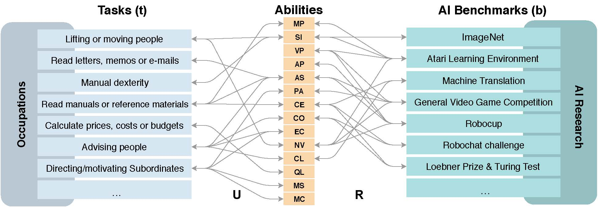

# AI & labour
Measuring the occupational impact of AI: tasks, cognitive abilities and AI benchmarks

In this work we develop a framework for analysing the impact of Artificial Intelligence (AI) on occupations. This framework maps 59 generic tasks from several worker surveys and databases to 14 cognitive abilities (that we extract from the cognitive science literature) and these to  a comprehensive list of 328 AI benchmarks used to evaluate progress in AI techniques. 

The use of cognitive abilities as an intermediate layer, instead of mapping work tasks to AI benchmarks directly, allows for an identification of potential AI exposure for tasks for which AI applications have not been explicitly created. An application of our framework to occupational databases gives insights into the abilities through which AI is most likely to affect jobs and allows for a ranking of occupations with respect to AI exposure. Moreover, we find that some jobs that were traditionally less affected by previous waves of automation may now be subject to relatively higher AI impact. Finally, we find that some of the least relevant abilities in work tasks are many of those where more progress is apparently taking place in AI (e.g., visual and auditory processing using deep learning and sensorimotor interaction, through (deep) reinforcement learning).
